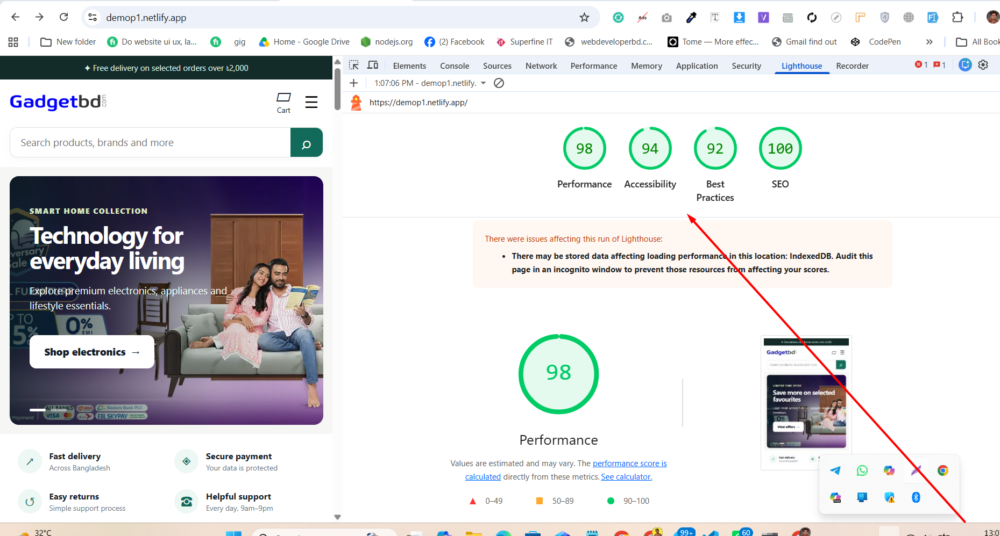

# Super Ecommerce — Next.js conversion

A modern Next.js App Router conversion of the provided Laravel e-commerce project.

## Included

- Responsive storefront: home, shop, categories, product details, search, cart, checkout, brands, offers, blogs and contact.
- Cart persisted in browser `localStorage`, quantity controls, coupon demo and checkout success page.
- Admin, vendor and reseller dashboard shells with representative navigation, metrics and table interfaces.
- Existing Laravel product/banner/logo assets reused from the supplied archive.
- Starter route handlers: `GET /api/products` and `POST /api/orders`.

## Run

```bash
npm install
npm run dev
```

Then open `http://localhost:3000`.

## Important backend migration note

This is a **Next.js frontend + API-ready conversion**. The original Laravel project contains databases, payment callbacks (bKash, ShurjoPay, UddoktaPay, AamarPay), courier webhooks, email/SMS, role permissions, vendor/reseller wallets, reports and order fraud checks. Those need server-side replacement and secure credentials before production.

Recommended next stack: Next.js Route Handlers + PostgreSQL/MySQL + Prisma/Drizzle + Auth.js/Clerk + secure server-side payment/courier adapters.

## Performance Audit

| Performance | Accessibility | Best Practices | SEO |
| :---------: | :-----------: | :------------: | :-: |
|     98      |      94       |       92       | 100 |



## Project Screenshot


Sondor vaby dakbo:
